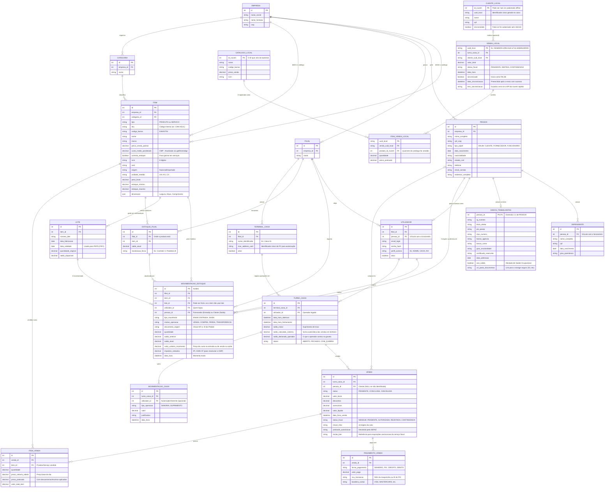

```mermaid
erDiagram
    EMPRESA {
        int id PK
        string razao_social
        string nome_fantasia
        string cnpj
    }

    FILIAL {
        int id PK
        int empresa_id FK
        string nome
    }

    PESSOA {
        int id PK
        int empresa_id FK
        string nome_completo
        string cpf_cnpj
        string tipo_papel "ENUM: CLIENTE, FORNECEDOR, FUNCIONARIO"
        date data_nascimento
        string nacionalidade
        string estado_civil
        string telefone
        string email_contato
        string endereco_completo
    }

    UTILIZADOR {
        int id PK
        int filial_id FK
        int pessoa_id FK "Vínculo com o funcionário"
        string email_login
        string senha_hash
        string perfil_acesso "Ex: ADMIN, CAIXA, RH"
        boolean ativo
    }

    DADOS_TRABALHISTAS {
        int pessoa_id PK, FK "Extensão 1:1 de PESSOA"
        string rg_numero
        string titulo_eleitor
        string pis_pasep
        string ctps_numero
        string banco_agencia
        string banco_conta
        string grau_escolaridade
        string certificado_reservista
        date data_admissao
        boolean aso_valido "Atestado de Saúde Ocupacional"
        string url_pasta_documentos "Link para o storage seguro (S3, etc)"
    }

    DEPENDENTE {
        int id PK
        int pessoa_id FK "Vínculo com o funcionário"
        string nome_completo
        string cpf
        date data_nascimento
        string grau_parentesco
    }

	ITEM {
        int id PK
        int empresa_id FK
        int categoria_id FK
        string tipo "PRODUTO ou SERVICO"
        string sku "Código Interno (ex: CAM-AZUL)"
        string codigo_barras "EAN/GTIN"
        string nome
        string marca
        decimal preco_venda_padrao
        decimal custo_medio_ponderado "CMP - Atualizado via gatilho/código"
        boolean controla_estoque "Para ignorar em serviços"
        string ncm "8 dígitos"
        string cest
        string origem "Nacional/Importado"
        string unidade_medida "UN, KG, CX"
        decimal peso_bruto
        decimal estoque_minimo
        decimal estoque_maximo
        json dimensoes "Largura, Altura, Comprimento"
    }

	ESTOQUE_FILIAL {
        int id PK
        int filial_id FK "Onde o produto está"
        int item_id FK
        decimal saldo_atual
        string localizacao_fisica "Ex: Corredor 3, Prateleira B"
    }

	LOTE {
        int id PK
        int item_id FK
        string numero_lote
        date data_fabricacao
        date data_validade "Usado para PEPS (FIFO)"
        decimal quantidade_original
        decimal saldo_disponivel
    }

    MOVIMENTACAO_ESTOQUE {
        int id PK "Kardex"
        int filial_id FK
        int item_id FK
        int lote_id FK "Pode ser NULL se o item não usar lote"
        int utilizador_id FK "Quem bipou"
        int pessoa_id FK "Fornecedor (Entrada) ou Cliente (Saída)"
        string tipo_movimento "ENUM: ENTRADA, SAIDA"
        string motivo_operacao "VENDA, COMPRA, PERDA, TRANSFERENCIA"
        string documento_origem "Chave NF-e, ID do Pedido"
        decimal quantidade
        decimal saldo_anterior
        decimal saldo_atual
        decimal valor_unitario_movimento "Preço de custo na entrada ou de venda na saída"
        decimal impostos_rateados "IPI, ICMS ST (para recalcular o CMP)"
        datetime data_hora "Momento exato"
    }

	CATEGORIA {
        int id PK
        int empresa_id FK
        string nome
    }

TERMINAL_CAIXA {
        int id PK
        int filial_id FK
        string nome_identificador "Ex: Caixa 01"
        string mac_address_uuid "Identificador único do PC para autorização"
        boolean ativo
    }

    TURNO_CAIXA {
        int id PK
        int terminal_caixa_id FK
        int utilizador_id FK "Operador logado"
        datetime data_hora_abertura
        datetime data_hora_fechamento
        decimal saldo_inicial "Suprimento de troco"
        decimal saldo_calculado_sistema "Soma automática das vendas em dinheiro"
        decimal saldo_declarado_operador "O que o operador contou na gaveta"
        string status "ABERTO, FECHADO, COM_QUEBRA"
    }

    MOVIMENTACAO_CAIXA {
        int id PK
        int turno_caixa_id FK
        int utilizador_id FK "Autorizador/Gerente (opcional)"
        string tipo_operacao "SANGRIA, SUPRIMENTO"
        decimal valor
        string justificativa
        datetime data_hora
    }

    VENDA {
        int id PK
        int turno_caixa_id FK
        int pessoa_id FK "Cliente (NULL se não identificado)"
        string status "PENDENTE, CONCLUIDA, CANCELADA"
        decimal valor_bruto
        decimal descontos
        decimal acrescimos
        decimal valor_liquido
        datetime data_hora_venda
        
        %% Dados Fiscais (NFC-e) - Preparação do terreno
        string status_fiscal "NENHUM, PENDENTE, AUTORIZADA, REJEITADA, CONTINGENCIA"
        string chave_nfce "44 dígitos da nota"
        string protocolo_autorizacao "Devolvido pela SEFAZ"
        string recibo_lote "Referência para requisições assíncronas do serviço fiscal"
    }

    ITEM_VENDA {
        int id PK
        int venda_id FK
        int item_id FK "Produto/Serviço vendido"
        decimal quantidade
        decimal preco_unitario_tabela "Preço base do dia"
        decimal preco_praticado "Com descontos/acréscimos aplicados"
        decimal valor_total_item
    }

    PAGAMENTO_VENDA {
        int id PK
        int venda_id FK
        string forma_pagamento "DINHEIRO, PIX, CREDITO, DEBITO"
        decimal valor_pago
        string nsu_transacao "NSU da maquininha ou ID do PIX"
        string bandeira_cartao "VISA, MASTERCARD, etc."
    }

	FILIAL ||--o{ TERMINAL_CAIXA : "possui"
    TERMINAL_CAIXA ||--o{ TURNO_CAIXA : "registra operações em"
    TURNO_CAIXA ||--o{ MOVIMENTACAO_CAIXA : "sofre"
    TURNO_CAIXA ||--o{ VENDA : "contém"
    
    VENDA ||--o{ ITEM_VENDA : "possui"
    VENDA ||--o{ PAGAMENTO_VENDA : "paga com"
    
    ITEM ||--o{ ITEM_VENDA : "vendido como"
    PESSOA |o--o{ VENDA : "compra em"
    UTILIZADOR ||--o{ TURNO_CAIXA : "opera"

	EMPRESA ||--o{ CATEGORIA : "organiza"
    EMPRESA ||--o{ ITEM : "detém o catálogo"
    CATEGORIA ||--o{ ITEM : "classifica"
    
    FILIAL ||--o{ ESTOQUE_FILIAL : "armazena"
    FILIAL ||--o{ MOVIMENTACAO_ESTOQUE : "registra"
    
    ITEM ||--o{ ESTOQUE_FILIAL : "possui saldo em"
    ITEM ||--o{ LOTE : "pode ser rastreado por"
    ITEM ||--o{ MOVIMENTACAO_ESTOQUE : "gera histórico"
    
    LOTE ||--o{ MOVIMENTACAO_ESTOQUE : "é movimentado"
    ESTOQUE_FILIAL ||--o{ MOVIMENTACAO_ESTOQUE : "atualizado por"
    
    UTILIZADOR ||--o{ MOVIMENTACAO_ESTOQUE : "realiza"
    PESSOA ||--o{ MOVIMENTACAO_ESTOQUE : "é origem ou destino de"

    %% Relacionamentos Núcleo
    EMPRESA ||--o{ FILIAL : "possui"
    EMPRESA ||--o{ PESSOA : "gere"
    EMPRESA ||--o{ ITEM : "detém o catálogo"
    %% Relacionamentos de Pessoas e Acessos
    PESSOA ||--o| UTILIZADOR : "possui acesso como"
    PESSOA ||--o| DADOS_TRABALHISTAS : "possui contrato"
    PESSOA ||--o{ DEPENDENTE : "possui"
    FILIAL ||--o{ UTILIZADOR : "aloja"


    CATALOGO_LOCAL {
        int id_nuvem PK "O ID que veio do backend"
        string nome
        string codigo_barras
        decimal preco_venda
        string ncm
        %% Apenas leitura. O caixa baixa isso no início do dia e não altera.
    }

    CLIENTE_LOCAL {
        int id_nuvem PK "Pode ser nulo se cadastrado offline"
        string uuid_local "Identificador único gerado no caixa"
        string nome
        string cpf
        boolean sincronizado "Falso se foi cadastrado sem internet"
    }

    VENDA_LOCAL {
        string uuid_local PK "Ex: 550e8400-e29b-41d4-a716-446655440000"
        int turno_caixa_id FK
        string cliente_uuid_local FK
        decimal valor_total
        string status_fiscal "PENDENTE, EMITIDA, CONTINGENCIA"
        datetime data_hora
        
        %% Controle de Sincronização
        boolean sincronizado "Inicia como FALSE"
        datetime data_sincronizacao "Preenchido após o envio com sucesso"
        string erro_sincronizacao "Guarda o erro se a API da nuvem rejeitar"
    }

    ITEM_VENDA_LOCAL {
        string uuid_local PK
        string venda_uuid_local FK
        int produto_id_nuvem FK "Qual item do catálogo foi vendido"
        decimal quantidade
        decimal preco_praticado
    }

	%% --- RELACIONAMENTOS DO BANCO LOCAL ---
    CLIENTE_LOCAL |o--o{ VENDA_LOCAL : "realiza (opcional)"
    VENDA_LOCAL ||--o{ ITEM_VENDA_LOCAL : "contém"
    CATALOGO_LOCAL ||--o{ ITEM_VENDA_LOCAL : "é registrado como"
```